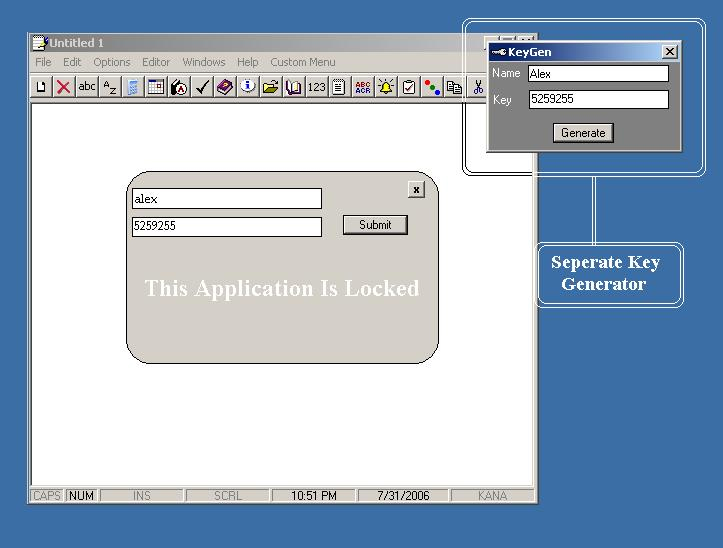



## Locking Application\. See how its done\. Includes a key generator\. Determines if its in IDE or EXE

### Description

This is a pretty simple example of how you can distribute your application as a shareware, and then sell the unlock-key to those interested in making a purchase. This app can also be formatted to give the user some time to test it before making the desicion to buy. The lock/unlock status is placed in the registry, in this case not well hidden, to make it easier for you to look-up. It should be placed in registry under a non-revealing name, and instead of registry value bieng changed from locked/unlocked, it should be something like 'H3ACE1&lt;username&gt;101325AAPPSTATUS'/'A1653E&lt;username&gt;80455EAPPSTATUS', to make it uneasy for registry-KnowItAlls to unlock.

*Using the LockingApp and key generator

When the application is in IDE mode, it will always include a button 'Get Key'. It will remain disabed until the username is entered. Then, by clicking Get Key button, you will get the key automatically entered in key textbox. Hit enter or Submit, and you are in. To reset the registration, goto menu-&gt;Options-&gt;Reset, and click OK.

When the application is compiled, the 'Get Key' button will disappear, so I included the key-generator. Just fire it up, enter name, click 'Generate' and thats all she wrote.

Remember, to reset registration menu-&gt;Options-&gt;Reset.

And dont be affraid to compile and run both, the app and keygen. You will see that the app. determines whether you are in IDE mode or .exe.

Thank you, Enjoy...
 
### More Info
 

             |
---                |---
**Submitted On**   |2006-09-04 20:57:38
**By**             |[Serge\_G](https://github.com/Planet-Source-Code/PSCIndex/blob/master/ByAuthor/serge-g.md)
**Level**          |Intermediate
**User Rating**    |4.0 (8 globes from 2 users)
**Compatibility**  |VB 4\.0 \(32\-bit\), VB 5\.0, VB 6\.0
**Category**       |[Complete Applications](https://github.com/Planet-Source-Code/PSCIndex/blob/master/ByCategory/complete-applications__1-27.md)
**World**          |[Visual Basic](https://github.com/Planet-Source-Code/PSCIndex/blob/master/ByWorld/visual-basic.md)
**Archive File**   |[Locking\_Ap201789942006\.zip](https://github.com/Planet-Source-Code/serge-g-locking-application-see-how-its-done-includes-a-key-generator-determines-if-its-in__1-66462/archive/master.zip)

